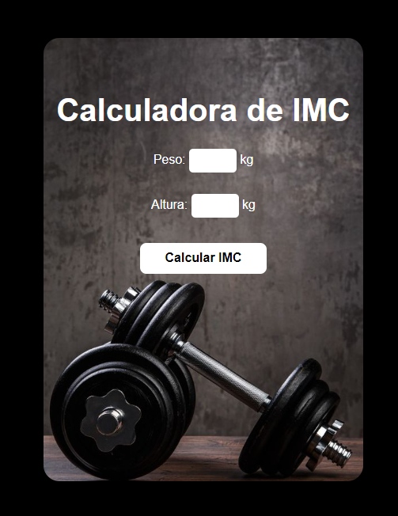
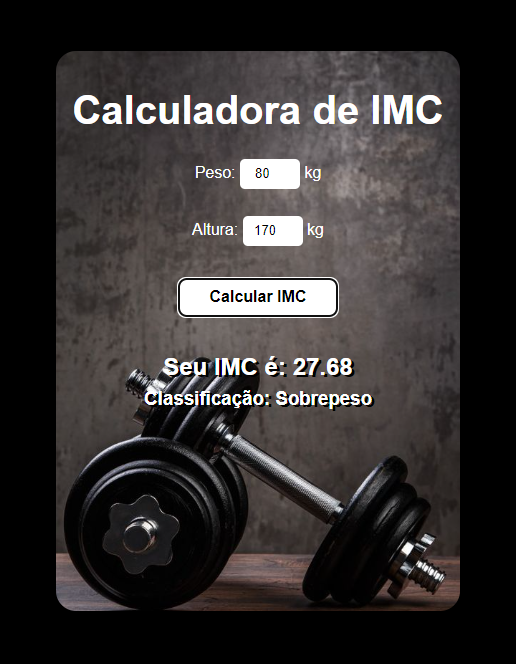

# Calculadora de IMC

Este é um simples projeto de calculadora de IMC (Índice de Massa Corporal) desenvolvido em REACT.

## Funcionalidades

- Calcula o IMC com base no peso e na altura fornecidos pelo usuário.
- Fornece uma interpretação do IMC calculado, indicando se o usuário está abaixo do peso, com peso normal, com sobrepeso, obeso ou muito obeso.

<table>
  <tr>
    <td></td>
    <td></td>
  </tr>
</table>
